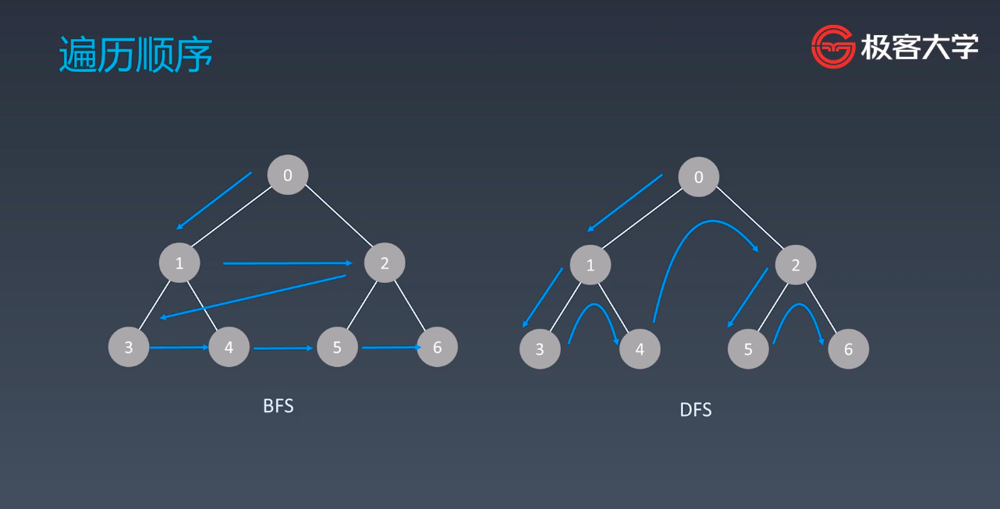

# 学习笔记 #

## 搜索 - 遍历 ##

+ 每个节点都要访问且仅访问一次
+ 对于节点的访问顺序不限
	+ **深度优先: depth first search**
	+ **广度优先: breadth first search**
	+ 其他自定义顺序: 优先级优先 / 启发式搜索



#### 深度优先搜索 ####

<font style="color:red">**代码模版:**</font>
```c++
map<int, int> visited;
void dfs(Node* root) {
  // terminator
  if (!root) {
    return;
  }
  if (visited.count(root->val)) { // 假设各节点的值不重复
    // already visited
    return;
  }
  
  visited[root->val] = 1;
  // process current node here.
  // ...
  for (int i = 0; i < root->children.size(); ++i) {
    dfs(root->children[i]);
  }
  return ;
}
```
```python
def dfs(node, visited):
  # if node in visited: # terminator
    # already visited 
    # return 在循环体内判断效果相同
  visited.add(node)

  # process current node
  ...
  for next_node in node.children():
    if not next_node in visited: # 先判断是否被访问过
      dfs(next_node, visited) # 该循环未走完时下一层先实现
```
非递归写法
```python
def dfs(self, tree):
  if tree.root is None:
    return []
    
  visited, stack = [], [tree.root] # 手动维护一个栈
  
  while stack:
    node = stack.pop()
    visited.add(node)
    
    process(node)
    nodes = generate_related_nodes(node)
    stack.push(nodes)
    
  # other processing work
```


#### 广度优先搜索 ####
<font style="color:red">**代码模版:**</font>
```c++
void bfs(Node* root) {
  map<int, int> visited;
  if(!root) {
    return;
  }
  
  queue<Node*> queueNode;
  queueNode.push(root);
  
  while (!queueNode.empty()) {
    Node* node = queueNode.top();
    queueNode.pop();
    if (visited.count(node->val))
      continue;
    visited[node->val] = 1;
    
    for (int i = 0; i < node->children.size(); ++i) { 
      queueNode.push(node->children[i]);
    }
  }
  return ;
}
```

#### <font style="color:grey">例题</font> ####
+ [x] [102. 二叉树的层序遍历](https://leetcode-cn.com/problems/binary-tree-level-order-traversal/)
+ [x] [433. 最小基因变化](https://leetcode-cn.com/problems/minimum-genetic-mutation/)
+ [x] [22. 括号生成](https://leetcode-cn.com/problems/generate-parentheses/)
+ [ ] [在每个树行中找最大值](https://leetcode-cn.com/problems/find-largest-value-in-each-tree-row/)
+ [x] [200. 岛屿数量](https://leetcode-cn.com/problems/number-of-islands/)
+ [x] [127. 单词接龙](https://leetcode-cn.com/problems/word-ladder/) <font style="color:red">双向BFS更高效</font>
+ [ ] [126. 单词接龙 II](https://leetcode-cn.com/problems/word-ladder-ii/description/)
+ [ ] [529. 扫雷游戏](https://leetcode-cn.com/problems/minesweeper/description/)

---
## 二分查找 BinarySearch ##
> 二分查找的前提
1. 目标函数单调性 <font style="color:red">在面试中使用此算法时需要跟面试官声明</font>
2. 存在上下界 **bounded**
3. 能够通过索引访问 **index accessible**

<font style="color:red">**代码模版:**</font>
```c++
int binarySearch(const vector<int>& nums, int target) {
  int left = 0, right = (int)nums.size() - 1; // 假设nums为递增序列
  // 终止条件为left_bound与right_bound汇合
  while (left <= right) {
    int mid = left + (right - left) / 2;
    if (nums[mid] == target) {
      return mid; // 命中target
    } else if (nums[mid] < target) {
      left = mid + 1; // 中间值在target的左侧
    } else {
      right = mid - 1; // 中间值在target的右侧
    }
  }
}
```

#### 牛顿迭代法 ####
> 在迭代过程中，以直线代替曲线，用一阶泰勒展式（即在当前点的切线）代替原曲线，求直线与 xx 轴的交点，重复这个过程直到收敛。


具体逻辑:
1. 确定函数方程表达式 y = f(x)
2. 在第i次迭代点在该曲线上的切线表达式为 y = f'(x[i]) * (x - x[i]) + f(x[i])
3. 另其等于0时得出下一次迭代点 x[i + 1] = x[i] - f(x[i]) / f'(x[i])


#### <font style="color:grey">例题</font> ####
+ [x] [69. x的平方根](https://leetcode-cn.com/problems/sqrtx/)
+ [x] [367. 有效的完全平方数](https://leetcode-cn.com/problems/valid-perfect-square/)
+ [x] [33. 搜索旋转排序数组](https://leetcode-cn.com/problems/search-in-rotated-sorted-array/)
+ [ ] [74. 搜索二维矩阵](https://leetcode-cn.com/problems/search-a-2d-matrix/)
+ [ ] [153. 寻找旋转排序数组中的最小值](https://leetcode-cn.com/problems/find-minimum-in-rotated-sorted-array/)

#### 思考题 ####
> 使用二分查找, 寻找一个半有序数组 `[4, 5, 6, 7, 0, 1, 2]` 中间无序的地方

该数组的前半段和后半段数组都满足单调关系
+ 前提条件: 单调性**已知/未知**, 数组元素**可重复/不重复**, 首位元素与末位元素是否**与整体单调性一致** `[3, 4, 5, 1, 2, 6, 7]`
+ 不一致时可直接用二分查找做, 当无法用两端值做判断选择时, 使用**分治**应该更合适

```c++
int left = 0; right = nums.size() - 1;
// 假设单调递增 且left > right
while (left - right + 1 != 0) { // 奇偶数组结果一样
  int mid = (left + right) / 2;
  if (nums[mid] > nums[left] && nums[mid] < nums[right]) { // left < mid > right && left > right [^]
    left = mid; // 说明左边一半保持递增
  } else if (nums[mid] < nums[left] && nums[mid] > nums[right]) { // left > mid < right && left > right [v]
    right = mid; // 右边一半保持递增
  } else {
    return; // ??? 这块应该已经不满足假设
  }
}
return right;
```
模拟运算:
+ `[4,5,6,7,0,1,2] -> [7,0,1,2] -> [7,0] -> return 0`
+ `[4,5,0,1,2,3] -> [4,5,0] -> [5,0] -> return 0`

33题搜索旋转排序数组[[题解1](https://leetcode-cn.com/problems/search-in-rotated-sorted-array/solution/ji-jian-solution-by-lukelee/)][[题解2](https://leetcode-cn.com/problems/search-in-rotated-sorted-array/solution/jian-ji-rong-yi-li-jie-java-er-fen-fa-by-breezean/)][[题解3](https://leetcode-cn.com/problems/search-in-rotated-sorted-array/solution/ji-jian-solution-er-fen-tiao-jian-de-tiao-jian-shu/)]:

```c++
int search(vector<int>& nums, int target) {
  int lo = 0, hi = nums.size() - 1;
  while (lo < hi) { // 每一次循环后目标减半 时间O(logn) 空间O(1)
    int mid = (lo + hi) / 2;
    // [0, mid]升序 && (target落在[mid, hi]区间)
    if (nums[0] <= nums[mid] && (target > nums[mid] || target < nums[0])) {
      lo = mid + 1;
    // [0, mid]存在旋转位 && (target落在[mid, hi]区间)
    } else if (target > nums[mid] && target < nums[0]) {
      lo = mid + 1;
    } else {
      hi = mid; // 向前规约
    }
  }
  return lo == hi && nums[lo] == target ? lo : -1;
}
```

---
## 贪心算法 Greedy ##

贪心算法是一种在每一步选择中都采取在当前状态下**最好或最优(即最有利)**的选择, 从而希望导致结果是最好或最优的算法.

贪心算法与动态规划的不同在于它对每个子问题的解决方案都做出选择, 不能回退. **动态规划则会保存以前的运算结果**, 并根据以前的运算结果对当前进行选择, 有回退功能

+ 贪心: 当下做局部的最优判断
+ 回溯: 能够回退
+ 动态规划: 最优判断 + 回退

贪心法可以解决一些最优化的问题, 如: 求图中最小生成树, 求哈夫曼编码等. 然而对于工程和生活中的问题, 贪心法一般不能得到需要的答案.

一旦一个问题可以通过贪心法来解决, 那么贪心法一般是解决这个问题的最好办法. 由于贪心法的高效性以及其所求得的答案比较接近最优结果, 贪心法也可以用作辅助算法或者直接解决一些要求不特别精确的问题.


#### <font style="color:grey">例题</font> ####
+ [x] [860. 柠檬水找零](https://leetcode-cn.com/problems/lemonade-change/)
+ [x] [122. 买卖股票的最佳时机 II](https://leetcode-cn.com/problems/best-time-to-buy-and-sell-stock-ii/)
+ [x] [455. 分发饼干](https://leetcode-cn.com/problems/assign-cookies/)
+ [x] [874. 模拟行走机器人](https://leetcode-cn.com/problems/walking-robot-simulation/) <font color="red">**需要复习**</font>
+ [ ] [55. 跳跃游戏](https://leetcode-cn.com/problems/jump-game/)
+ [ ] [45. 跳跃游戏 II](https://leetcode-cn.com/problems/jump-game-ii/)


