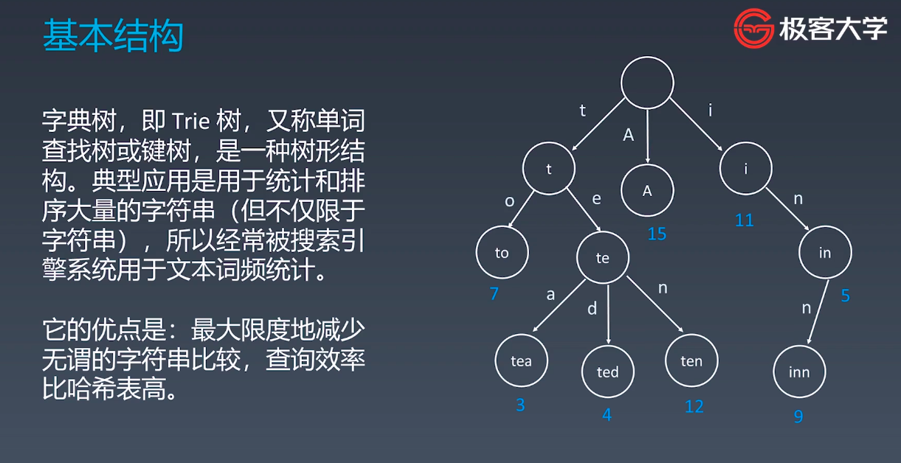

# 学习笔记 #

#### 1.1 字典树 Trie ####

Trie树的核心思想是空间换时间.

利用字符串的公共前缀来降低查询时间的开销以达到提高效率的目的



Trie树代码模版
```C++
class Trie {
  struct TrieNode { // 额外定义节点
    map<char, TrieNode*> child_table; // 子树集
    int end; // 该节点为单词的末尾
    TrieNode(): end(0) {}
  };
 public:
  /** Initialize your data structure here. */
  Trie() {
    root = new TrieNode(); 
  }
  /** Inserts a word into the trie. */
  void insert(string word) {
    TrieNode *curr = root;
    for (int i = 0; i < word.size(); i++) {
      if (curr->child_table.count(word[i]) == 0) {
        curr->child_table[word[i]] = new TrieNode();
      }
      curr = curr->child_table[word[i]];
    }
    curr->end = 1;
  }
  /** Returns if the word is in the trie. */
  bool search(string word) {
    return find(word, 1);
  }
  /** Returns if there is any word in the trie
   ** that starts with the given prefix. */
  bool startsWith(string prefix) {
    return find(prefix, 0);
  }
 private:
  TrieNode* root;
  bool find(string s, int exact_match) {
    TrieNode *curr = root;
    for (int i = 0; i < s.size(); i++) {
      if (curr->child_table.count(s[i]) == 0) {
        return false;
      } else {
        curr = curr->child_table[s[i]];
      }
    }
    if (exact_match) {
      return (curr->end) ? true : false;
    } else {
      return true;
    }
  }
};
```

#### 1.2 并查集 UnionSet ####

基本操作:
+ makeSet(s) 建立一个新的并查集, 其中包含s和单元素集合
+ unionSet(x, y) 把元素x和y所在的集合合并, 要求x和y所在的集合不相交, 如果相交则不合并
+ find(x): 找到元素x所在的集合的代表, 该操作也可以用于判断两个元素是否位于同一个集合, 只要将它们各自的代表比较一下就可以

```c++
class UnionFind {
 public:
  UnionFind(vector<vector<int>>& matrix) {
    // 可以在构造的时候依据需求特殊计算count
    for (int i = 0; i < matrix.size(); i++) {
      parent_.push_back(i);
      rank_.push_back(0);
    }
    count_ = matrix.size();
  }

  int find(int x) {
    // 注意在dfs的时候顺便把子树的下角标都指向root以达到缩减下探路径的目的
    return parent_[x] = (parent_[x] == x ? x : find(parent_[x]));
  }

  void merge(int x, int y) {
    int root_x = find(x), root_y = find(y);
    if (root_x != root_y) {
      // 应该是尽量向长的集合合并
      if (rank_[root_x] > rank_[root_y]) {
        swap(root_x, root_y);
      }
      parent_[root_x] = root_y;
      if (rank_[root_x] == rank_[root_y]) {
        rank_[root_y]++;
      }
      count_--; // 记得要将总集合计数-1
    }
  }

private:
  int count_; // 可另定义函数取集合统计
  vector<int> parent_, rank_;
};
```	

#### 2.1 剪枝 DFS Pruning ####


#### 2.2 双向 Double-Edned BFS ####

Template:
```C++
template<typedef Tp>
void double_ended_bfs(Tp begin, Tp end, vector<Tp> list) {
  // 使用unordered_set代替queue代表每一次待遍历的节点
  unordered_set<Tp> bfs_forward, bfs_backward;
  bfs_forward.insert(begin);
  bfs_backward.insert(end);
  // 每次从一个方向推进一层
  while (!bfs_forward.empty() && !bfs_backward.empty()) {
    // 让较小的队列作为bfs对象
    if (bfs_forward.size() > bfs_backward.size()) {
      swap(bfs_forward, bfs_backward);
    }
    // 使用新的节点集合, 检查有效的分支
    unordered_set<Tp> new_forward;
    // 从forward方向遍历
    for (Tp element : bfs_forward) {
      chage_state(element);
      if (list.find(element)) {
        list.erase(element);
        new_forward.insert(element);
      }
      // 说明前后推进已经打通
      if (bfs_backward.count(element)) {
        return;
      }
      unchange_state(element); // 当前状态回溯
    }
    bfs_forward = new_forward; // 更新bfs队列
  }
  return;
}
```

#### 2.3 启发式搜索 Heuristic Search ####

利用当前与问题有关的信息作为启发式信息，这些信息是能够提升查找效率以及减少查找次数

```c++
class Node {
 public:
  int x;
  int y;
  bool operator< (const Node &A) {
    //
  }
};

void generate_related_nodes(Node &node) {
  //
}

void process(Node &node) {
  //
}

void AstarSearch(vector<vector<int>>& graph, Node& start, Node& end) {
  vector<vector<bool>> visited(graph.size(), vector<bool>(graph[0].size(), false));
  priority_queue<Node> q;
  q.push(start);
  
  while (!q.empty()) {
    // 每次处理优先级最大的元素
    Node cur = q.top();
    q.pop();
    visited[cur.x][cur.y] = true;
    
    process(node);
    // 依据估价函数生成搜索节点
    vector<Node> nodes = generate_related_nodes(node)
    for (auto node : nodes) {
      if (!visited[node.x][node.y])
        q.push(node);
    }
  }
  return;
}
```

估价函数: h(n), 它用来评价哪些节点最有希望的是我们要找的节点, h(n)会返回一个非负实数, 也可以认为是从节点n的目标节点路径的估计成本.

启发式函数是一种告知搜索方向的方法. 它提供了一种明智的方法来猜测哪个邻居节点会导向一个目标.

#### 3.1 AVL树 ####


#### 3.2 红黑树 ####

